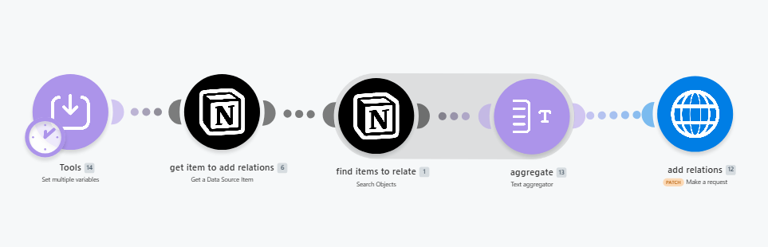

# make-notion-add-multiple-relations
Add multiple relations to a Notion page in one update, by searching a source database and bulk-linking all matching items via the API.

# Notion: Add Multiple Relations in One Update

Add many relations to a Notion page property in a single API call.  
Searches a source database, collects all matching item IDs, and patches 
them into the relation property on a target page.

Make's native Notion "Update Item" module forces you to set relations one 
by one or hardcode IDs in advance. This template skips that by hitting the 
Notion API directly with a dynamically aggregated relation array.

## What it solves

You have a Notion database "Projects" and another "Tasks". You want to 
link a Project to many Tasks at once based on a query (all tasks 
matching a status, all clients in a region, all products in a category).

The native Make module makes this painful. This template makes it one run.

## What you need

- Make.com account (free tier works)
- Notion integration token (https://www.notion.so/profile/integrations)
- The target page ID (item that will receive the relations)
- The source database ID (items to find and link)
- The exact name of the relation property on the target page

Both databases must be shared with your Notion integration.

## Setup (5 min)

1. Download [Download workflow.json](make-notion-add-multiple-relations.json)
2. In Make.com: Create scenario → ••• → Import Blueprint → select the file
3. Open Module 14 (Set Variables) and fill in:
   - `data source item id` - the page ID to add relations TO
   - `relations property name` - exact column name on the target page  
     (case-sensitive, e.g. "Linked Tasks")
   - `multiple relations database id` - the source database/data source ID
   - `notion token` - your integration's internal secret  
     (starts with `ntn_` or `secret_`)
4. Connect your Notion account in modules 6 and 1
5. Run

## How it works

1. **Set Variables** - holds the 4 inputs (target page, property name, source DB, token)
2. **Get Database Item** - fetches the target page where relations will be added
3. **Search Objects** - returns every item in the source database  
   (add filters here if you only want a subset)
4. **Text Aggregator** - joins each found item as `{ "id": "..." }`, comma-separated
5. **HTTP PATCH** to `https://api.notion.com/v1/pages/{target_id}` -  
   updates the relation property with the full array in one request

## Filtering which items to link

By default, this links ALL items from the source database. To link only 
a subset, open Module 1 (Search Objects) and add a filter, for example:
- Status equals "Active"
- Region contains "EU"
- Last edited within last 7 days

The Text Aggregator and PATCH downstream will work with whatever subset 
Search Objects returns.

## Why direct API instead of Notion module

- Native Notion "Update Item" requires the relation IDs to be statically 
  mapped at design time
- It fails or hits limits when you have 50+ items to relate
- The HTTP PATCH approach handles arrays of any size in one call  
  (Notion API limit: 100 relations per property per update)

## Notion-Version note

This template uses Notion API version `2022-06-28`. If Notion ships  
breaking changes, update the `Notion-Version` header in Module 12.

## Schedule

Trigger this however fits:
- Webhook (replace Module 14 with a webhook trigger)
- On schedule (daily, hourly)
- After another scenario (chain via Make scenario links)

## Screenshot

## Built by Ozan Atmar

I build Make.com automations and web apps for founders.  
Site: https://ozan.at/mar  
Email: ozanatmar@gmail.com
